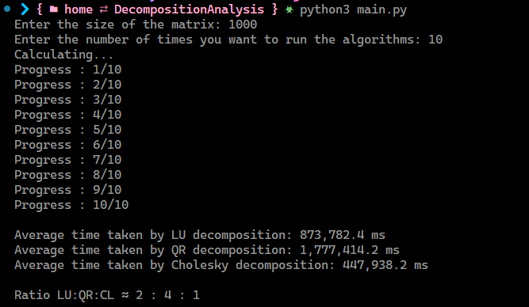

# Decomposition Analysis

## Introduction
Matrix decomposition methods, such as LU, QR, and Cholesky, play a pivotal role in various computational tasks, offering distinct approaches to break down matrices into simpler components. In this study, we investigate the computational efficiency of these methods by analyzing the average time required to decompose a matrix of size n. The aim is to discern the relative performance of LU, QR, and Cholesky decompositions

## Methods
LU, QR, and Cholesky decomposition methods were implemented in C++ using the Eigen library. The average time needed to decompose a matrix of size n was determined by averaging the time required to decompose m randomly generated matrices of size n. The decomposition time for each matrix was measured using the chrono library.

## Libraries
- `Numpy`
- `timeit`
- `matplotlib`
- `csv`
## Results
The average time required to decompose a matrix of `size 1000` was calculated for `n = 10`. The results are shown in the table below.

| Method | Average Time (ns) |
| --- | --- |
| LU | 873,782.4 ms |
| QR | 1,777,414.2 ms |
| Cholesky | 447,938.2 ms |

**`Ratio LU:QR:CL =  2 : 4 : 1`**

# Conclusion
In the obtained results, it's evident that the Cholesky decomposition method exhibits the highest speed, followed by the LU decomposition method, and finally, the QR decomposition method. Interestingly, the results highlight that the QR decomposition method is twice as slow as the LU decomposition and four times slower than the Cholesky decomposition methods.
